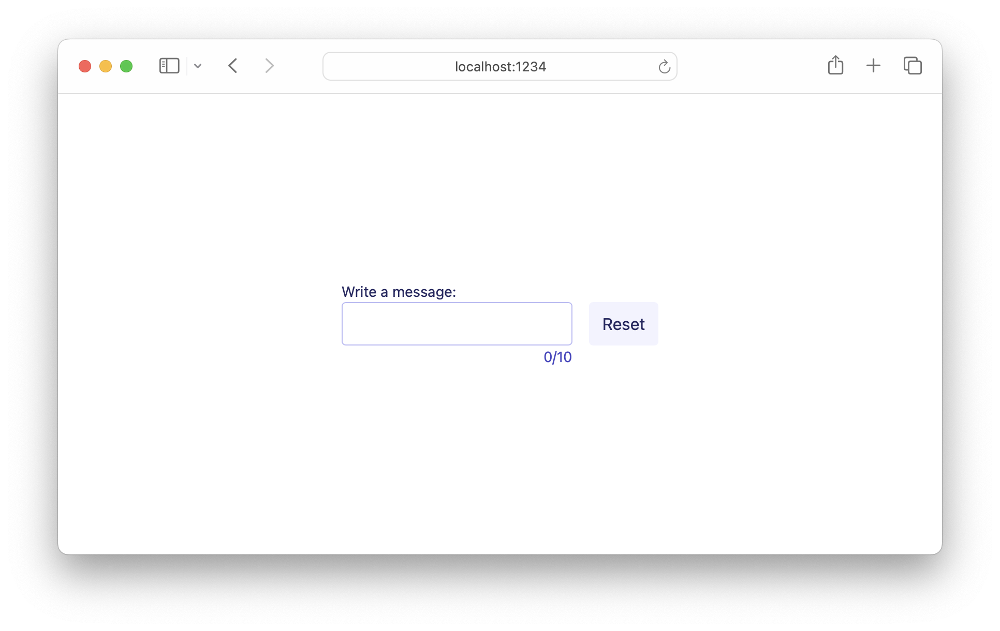

# 03 Controlled Inputs

The most common way to handle inputs and other state-holding elements is in a
_controlled_ way. This means your app's model is the source of truth for that
element's state, and you update that state based on user input or other events.

This example shows what that means in practice. For any controlled input we need
two things:

- A field in our model (or a function to derive a value from the model) to use
  as the input's `value` attribute.

- A message variant to handle input events and update the model.

```gleam
ui.input([
  // Input's value is fixed to the model's `value` field
  attribute.value(model.value),
  // Whenever the input changes, we send a `UserUpdatedMessage` message with the
  // new value
  event.on_input(UserUpdatedMessage)
])
```

## Why is this beneficial?

Central to Lustre's architecture is the idea that your model is the single source
of truth for your application's UI. This opens up the door to things like serialising
program state to load in the future, time-travel debugging, and rehydrating your
app's state from a server.

It also gives you tighter control of when and how to update your UI in response
to user input. In this example, we only update the model when the new input
value is less than 10 characters long.

```gleam
case msg {
  UserUpdatedMessage(value) -> {
    let length = string.length(value)

    case length <= model.max {
      True -> Model(..model, value: value, length: length)
      False -> model
    }
  }

  ...
```

## A note on message naming

In our [state management guide](https://hexdocs.pm/lustre/guide/02-state-management.html)
we touch on the idea of "messages not actions." We think the best way to name your
messages is following a "Subject Verb Object" pattern: `UserUpdatedMessage` not
`SetMessage` and so on.

This approach to message naming can feel a cumbersome at first, especially for
small examples like this. One of Lustre's super powers is that as your app grows
in size, your `Msg` type becomes a very helpful overview of all the different
events your app can handle. When they take the form of `Subject Verb Object` it
gives you an immediate sense of the different things that speak to your app: how
much is coming from your backend, how much is user input, and so on.

## Getting help

If you're having trouble with Lustre or not sure what the right way to do
something is, the best place to get help is the [Gleam Discord server](https://discord.gg/Fm8Pwmy).
You could also open an issue on the [Lustre GitHub repository](https://github.com/lustre-labs/lustre/issues).
