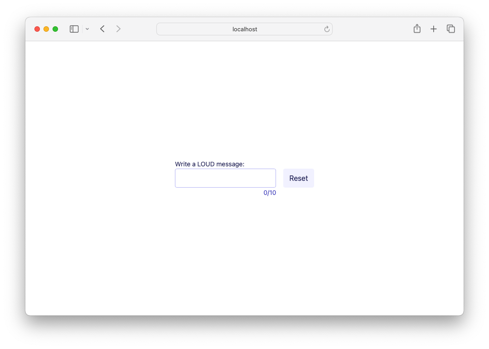

# 04 Custom Event Handlers

While Lustre's built-in event handlers can cover most of your basic needs, in practice you will often need to provide more advanced functionality. For this, we can reach for the `event.on("eventname", handler)` function to generate attributes that can provide custom event handling.

But first, let's take a look under the hood to see what event handlers actually _do_.

## Decoding Dynamic Data

Lustre is a type-safe framework, but the DOM allows HTML elements to generate events containing values of any arbitrary type and structure. In Gleam, such data is referred to as _dynamic_, and is handled by the `gleam/dynamic` library. `gleam/dynamic` is used for decoding everything from unpredictable JSON input to Lustre's DOM events.

If you peek at [the gleam\dynamic documentation](https://hexdocs.pm/gleam_stdlib/0.17.1/gleam/dynamic/#module-types), you'll quickly see it exports four types:

```gleam
  pub external type Dynamic
  // data for which we don't know the type

  pub type DecodeError { ... }
  // the error returned when unexpected data is encountered

  pub type DecodeErrors = List(DecodeError)

  pub type Decoder(t) = fn(Dynamic) -> Result(t, DecodeErrors)
  // any function that accepts dynamic data and returns a Result(t, DecodeErrors)
```

In Lustre, all DOM event values are converted to `Dynamic` values before being passed to their respective handlers. Event handlers accept those `Dynamic` values and return a `Result` of either `Ok(Msg)`, or `DecodeErrors` - the `DecodeError` list.

Therefore, Lustre event handlers are simply an implementation of the `Decoder` function type.

## Writing A Custom Input Handler

In javascript, input event handlers often look something like this:

```js
function onInput(event) {
  const input = event.target.value;
  // do your stuff!
}
```

This is very convenient! But it's not type-safe. From the function's perspective, there is no guarantee that _`event`_ is an object with a property named _`target`_ which itself has a property named _`value`_. In a more complex app, we might even pass it a numeric or boolean value on accident. The failure to handle such error conditions leads to many `Uncaught TypeError` crashes.

Here's how we can extract the event's dynamic value in a type-safe way in Lustre:

```gleam
  let on_input = fn(event: dynamic.Dynamic) -> Result(Msg, dynamic.DecodeErrors) {
    use target <- result.try(dynamic.field("target", dynamic.dynamic)(event))
    use value <- result.try(dynamic.field("value", dynamic.string)(target))
    // do your stuff!
    Ok(GotInput(value))
  }
```

First we extract the `target` field from our `event`, which is expected to be of the type `dynamic.dynamic`. Because the target is itself dynamic, we can again use the dynamic library to extract its `value` field, which is expected to be of type `dynamic.string`. If either of those expectations are not met, the function will return an error, and nothing more will happen.

This is such a common use case that Lustre's `event` module has a helper function for it. Here is a far less verbose version that provides the exact same type-safe guarantees:

```gleam
  let on_input = fn(event) {
    use value <- result.try(event.value(event))
    // do your stuff!
    Ok(GotInput(value))
  }
```

## Make it Loud

In this [example code](./src/app.gleam#L63), we define a custom input handler called `make_it_loud`, which calls `string.uppercase` to make sure all our input is LOUD. Then in our [view function](./src/app.gleam#L79), instead of calling `event.on_input(GotInput)` like we did in the last example, we can just call `event.on("input", make_it_loud)`.

## Getting help

If you're having trouble with Lustre or not sure what the right way to do
something is, the best place to get help is the [Gleam Discord server](https://discord.gg/Fm8Pwmy).
You could also open an issue on the [Lustre GitHub repository](https://github.com/lustre-labs/lustre/issues).
