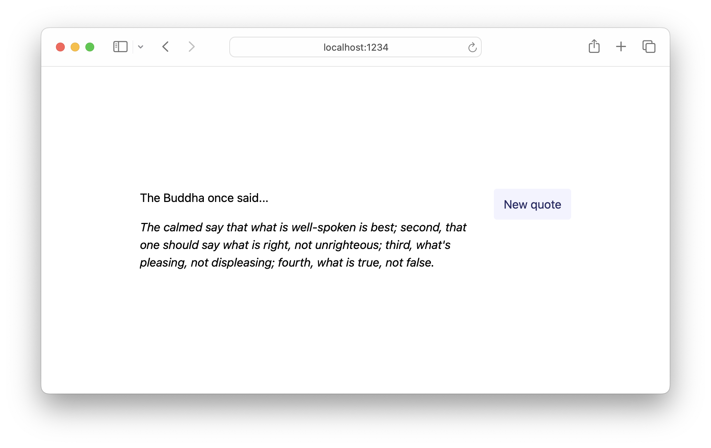

# 05 HTTP Requests

In the previous examples, we've seen Lustre applications constructed with the
[`lustre.simple`](https://hexdocs.pm/lustre/lustre.html#simple) constructor.
These kinds of applications are great for introducing the Model-View-Update (MVU)
pattern, but for most real-world applications we'll need a way to talk to the
outside world.

Lustre's runtime includes _managed effects_, which allow us to perform side effects
like HTTP requests and communicate the results back to our application's `update`
function. To learn more about Lustre's effect system and why it's useful, check
out the [side effects guide](https://hexdocs.pm/lustre/guide/03-side-effects.html),
or the docs for the [`lustre/effect` module](https://hexdocs.pm/lustre/lustre/effect.html).

This example is a practical look at what effects mean in Lustre, and we'll look
at how to send HTTP requests in a Lustre application: a pretty important thing to
know!

## Moving on from `lustre.simple`

From this example onwards, we will use a new application constructor:
[`lustre.application`](https://hexdocs.pm/lustre/lustre.html#application). Full Lustre
applications have the ability to communicate to the runtime. Let's compare the type
of both the `simple` and `application` functions:

```gleam
pub fn simple(
  init: fn(flags) -> model,
  update: fn(model, msg) -> model,
  view: fn(model) -> Element(msg),
) -> App(flags, model, msg)

pub fn application(
  init: fn(flags) -> #(model, Effect(msg)),
  update: fn(model, msg) -> #(model, Effect(msg)),
  view: fn(model) -> Element(msg),
) -> App(flags, model, msg)
```

All that's changed is the return type of our `init` and `update` functions. Instead
of returning just a new model, they now return a tuple containing both a model and
any side effects we want the runtime to perform.

You'll notice that running a Lustre app with side effects _changes the signature_
of our [`init`](src/app.gleam#L43) and [`update`](src/app.gleam#L54) functions.
Instead of returning just a model, we return a tuple containing both a model an
an `Effect(Msg)` value. The effect value specifies any further updates we might
want the Lustre runtime to execute before the next invocation of the `view`
function.

> **Note**: notice how the type of `view` remains the same. In Lustre, your `view`
> is always a [_pure function_](https://github.com/lustre-labs/lustre/blob/main/pages/hints/pure-functions.md)
> that takes a model and returns the UI to be rendered: we never perform side effects
> in the `view` function itself.

## HTTP requests as side effects

The community library [`lustre_http`](https://hexdocs.pm/lustre_http/) gives us
a way to model HTTP requests as Lustre `Effect`s. Crucially, when we call
`lustre_http.get` we are _not_ performing the request! We're constructing a
description of the side effect that we can hand off to the Lustre runtime to
perform.

```gleam
fn get_quote() -> Effect(Msg) {
  let url = "https://api.quotable.io/random"
  let decoder =
    dynamic.decode2(
      Quote,
      dynamic.field("author", dynamic.string),
      dynamic.field("content", dynamic.string),
    )

  lustre_http.get(url, lustre_http.expect_json(decoder, ApiUpdatedQuote))
}
```

To construct HTTP requests, we need a few different things:

- The `url` to send the request to.

- A description of what we _expect_ the result to be. There are a few options:
  `expect_anything`, `expect_text`, `expect_json`. In this example we say we're
  expecting a JSON response and provide a decoder.

- Along with what we expect the response to be, we also need to provide a way
  to turn that response into a `Msg` value that our `update` function can handle.

The same applies for post requests too, but there you also need to provide the
JSON body of the request.

## Tying it together

We now have a function that can create an `Effect` for us, but we need to hand it
to the runtime to be executed. The only way we can do that is by returning it from
our `update` (or `init`) function! We attach an event listener on a button, and
when the user clicks that button we'll return the `Effect` we want to perform as
the second element of a tuple:

```gleam
fn view(model: Model) -> Element(Msg) {
  ui.centre([],
    ui.button([event.on_click(UserClickedRefresh)], [
      element.text("New quote"),
    ]),
  )
}

fn update(model: Model, msg: Msg) -> #(Model, Effect(Msg)) {
  case msg {
    UserClickedRefresh -> #(model, get_quote())
    ...
  }
}
```

Of course, we need to handle responses from the quote API in our `update` function
too. When there are no side effects we want the runtime to perform for us, we need
to call `effect.none()`:

```gleam
fn update(model: Model, msg: Msg) -> #(Model, Effect(Msg)) {
  case msg {
    ...
    ApiUpdatedQuote(Ok(quote)) -> #(Model(quote: Some(quote)), effect.none())
    ApiUpdatedQuote(Error(_)) -> #(model, effect.none())
  }
}
```

## Getting help

If you're having trouble with Lustre or not sure what the right way to do
something is, the best place to get help is the [Gleam Discord server](https://discord.gg/Fm8Pwmy).
You could also open an issue on the [Lustre GitHub repository](https://github.com/lustre-labs/lustre/issues).
