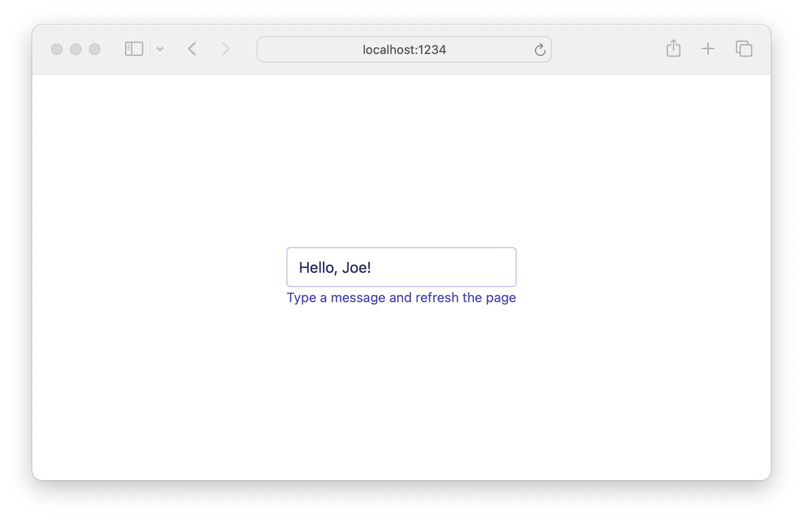

# 06 Custom Effects

In the last example, we showed how to use effects provided by `lustre_http`. In
this example we'll see how to create effects of our own using Lustre's
[`effect.from`](https://hexdocs.pm/lustre/lustre/effect.html#from)
function.

Since we use effects to communicate with _external_ systems (like the browser or
the Erlang VM) you'll find creating custom effects usually involves Gleam's
[external functions](https://tour.gleam.run/everything/#advanced-features-externals).
So be sure to read up on that!

> Gleam externals are part of its "foreign function interface", which is why
> you'll typically see files with `ffi` in the name - like
> [`app.ffi.mjs`](./src/app.ffi.mjs).

## Accessing Browser Storage

In this example, the external system we want to interact with is the browser's
[local storage](https://developer.mozilla.org/en-US/docs/Web/API/Window/localStorage).
This way, we can write a message into the text input and it will still be there
when we refresh the page. Handy!

The `view`, `update` and `init` functions should look pretty familiar by now, so
let's focus on the functions that generate our custom effects.

```rust
fn read_localstorage(key: String) -> Effect(Msg) {
    effect.from(fn(dispatch) {
        do_read_localstorage(key)
        |> CacheUpdatedMessage
        |> dispatch
    })
}
```

We use `effect.from` by passing it a custom function that describes the effect
we want the Lustre runtime to perform. Our custom function will receive a
`dispatch` function as its only parameter - we can use that to send new messages
back to our `update` function if we want to.

In this case, we read from local storage, pipe its value into the
`CacheUpdatedMessage` constructor, and pipe that to the `dispatch` function so
our `update` messsage can handle it.

```rust
fn write_localstorage(key: String, value: String) -> Effect(msg) {
    effect.from(fn(_) {
        do_write_localstorage(key, value)
    })
}
```

Here, our effect is simpler. We tell the gleam compiler we don't need to use the
`dispatch` function by replacing it with a [discard
pattern](https://tour.gleam.run/everything/#basics-discard-patterns). Then we
write to local storage, and no more work needs to be done.

You may be wondering, why bother using an effect if we aren't also going to update
our program with the result? Why not just fire off `do_write_localstorage` directly
from the `update` function or a custom event handler?

Using effects has many benefits! It lets us implement our `update` and `view`
functions as [pure functions](https://github.com/lustre-labs/lustre/blob/main/pages/hints/pure-functions.md).
This makes them easier to test, allows for time-travel debugging, and even opens
the door to easily porting them to [server components](https://hexdocs.pm/lustre/lustre/server_component.html).

## Another note on message naming

In our [controlled inputs
example](https://github.com/lustre-labs/lustre/tree/main/examples/03-controlled-inputs)
we touched on the idea of naming messages in a "Subject Verb Object" pattern.
This example neatly shows the benefits of taking such an approach once different
"things" start talking to your application.

It would be easy to have a single `SetMessage` variant that both the user input
and local storage lookup use to update the model, but doing so might encourage
us to conceal the fact that the local storage lookup can fail and makes it
harder to see what things our app deals with.

## Getting help

If you're having trouble with Lustre or not sure what the right way to do
something is, the best place to get help is the [Gleam Discord
server](https://discord.gg/Fm8Pwmy). You could also open an issue on the [Lustre
GitHub repository](https://github.com/lustre-labs/lustre/issues).
